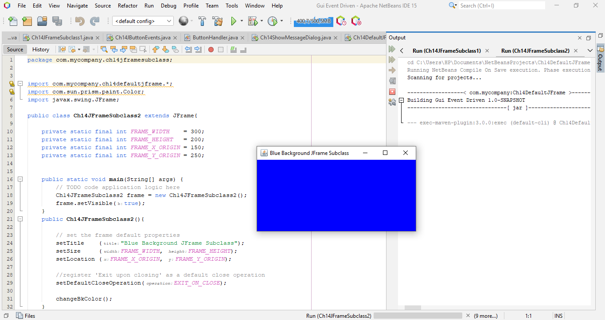

# Tugas Praktikum 9
## Pemrograman Orientasi Objek

```sh
Nama   : Raihan Tantowi
Nim    : 312110229
Matkul : Pemrograman Orientasi Objek
```
#### 1. Chapter 14 Show Message Dialog
* **File Ch14ShowMessageDialog.java :**
```java
package com.mycompany.ch14showmessagedialog; 
 
import javax.swing.*;  
class Ch14ShowMessageDialog {
    public static void main(String[] args) {
        JFrame jFrame;
        
        jFrame = new JFrame();
        jFrame.setSize(400,300);
        jFrame.setVisible(true);
        
        JOptionPane.showMessageDialog(jFrame, "How are you");
        
        JOptionPane.showMessageDialog(null, "Good Bye");
        
        JOptionPane.showMessageDialog(null, "one\ntwo\nthree");
        
        JOptionPane.showInputDialog(null, "Enter text");
        
        String input;
        
        input = JOptionPane.showInputDialog(null, "Enter text");
        
        String str 
                = JOptionPane.showInputDialog(null, "Enter age:");
        int age = Integer.parseInt(str);
    }
}
```

* **Berikut adalah hasil output program:**


#### 2. Chapter 14 Default JFrame
* **File Ch14DefaultJFrame.java :**
```java
package com.mycompany.ch14defaultjframe;

import javax.swing.*;

class Ch14DefaultJFrame {
    public static void main (String[] args) {
        JFrame defaultJFrame;
        defaultJFrame = new JFrame();
        defaultJFrame.setVisible(true);
    }
}
```

* **Berikut adalah hasil output program:**


#### 3. Chapter 14 JFrame Subclass
* **File Ch14JFrameSubclass1.java :**
```java
package com.mycompany.ch14jframesubclass;

import com.mycompany.ch14defaultjframe.*;
import javax.swing.JFrame;
//import static javax.swing.JFrame.EXIT_ON_CLOSE;


public class Ch14JFrameSubclass1 extends JFrame {

    private static final int FRAME_WIDTH    = 300;
    private static final int FRAME_HEIGHT   = 200;
    private static final int FRAME_X_ORIGIN = 150;
    private static final int FRAME_Y_ORIGIN = 250;


    public static void main(String[] args) {
        // TODO code application logic here
        Ch14JFrameSubclass1 frame = new Ch14JFrameSubclass1();
        frame.setVisible(true);
    }

    public Ch14JFrameSubclass1() {

        // set the frame default properties
        setTitle    ("My First Subclass");
        setSize     (FRAME_WIDTH, FRAME_HEIGHT);
        setLocation (FRAME_X_ORIGIN, FRAME_Y_ORIGIN);

        // register 'exit upon closing' as a default close operation
        setVisible(true);
        setDefaultCloseOperation( EXIT_ON_CLOSE);

    }

}
```

* **Berikut adalah hasil output program:**


* **File Ch14JFrameSubclass2.java :**
```java
package com.mycompany.ch14jframesubclass;


import com.mycompany.ch14defaultjframe.*;
import com.sun.prism.paint.Color;
import javax.swing.JFrame;

public class Ch14JFrameSubclass2 extends JFrame{

    private static final int FRAME_WIDTH    = 300;
    private static final int FRAME_HEIGHT   = 200;
    private static final int FRAME_X_ORIGIN = 150;
    private static final int FRAME_Y_ORIGIN = 250;


    public static void main(String[] args) {
        // TODO code application logic here
        Ch14JFrameSubclass2 frame = new Ch14JFrameSubclass2();
        frame.setVisible(true);
    }
    public Ch14JFrameSubclass2(){

        // set the frame default properties
        setTitle    ("Blue Background JFrame Subclass");
        setSize     (FRAME_WIDTH, FRAME_HEIGHT);
        setLocation (FRAME_X_ORIGIN, FRAME_Y_ORIGIN);

        //register 'Exit upon closing' as a default close operation
        setDefaultCloseOperation(EXIT_ON_CLOSE);

        changeBkColor();
    }

    private void changeBkColor(){
        java.awt.Container contentPane = getContentPane();
        contentPane.setBackground(java.awt.Color.blue);
    }

}
```

* **Berikut adalah hasil output program:**




#### 4. Chapter 14 JButton Frame
* **File Ch14JButtonFrame.java :**
```java
package com.mycompany.ch14jbuttonframe;

import javax.swing.*;
import java.awt.*;

class Ch14JButtonFrame extends JFrame{

    private static final int FRAME_WIDTH    = 300;
    private static final int FRAME_HEIGHT   = 200;
    private static final int FRAME_X_ORIGIN = 150;
    private static final int FRAME_Y_ORIGIN = 250;

    private JButton cancelButton;
    private JButton okButton;

    public static void main(String[] args) {
        Ch14JButtonFrame frame = new Ch14JButtonFrame();
        frame.setVisible(true);
    }
    public Ch14JButtonFrame(){
        Container contenPane = getContentPane();

        setSize     (FRAME_WIDTH, FRAME_HEIGHT);
        setResizable(false);
        setTitle    ("Program Ch14JButtonFrame");
        setLocation (FRAME_X_ORIGIN, FRAME_Y_ORIGIN);

        //set the layout manager
        contenPane.setLayout(new FlowLayout());

        //create andplace two buttons on the frame's content pane
        okButton = new JButton("OK");
        contenPane.add(okButton);
        cancelButton = new JButton("CANCLE");
        contenPane.add(cancelButton);

        setDefaultCloseOperation(EXIT_ON_CLOSE);
    }
}
```

* **Berikut adalah hasil output program:**


#### 5. Chapter 14 JButton Events
* **File Ch14JButtonEvents.java :**
```java
package com.mycompany.ch14jbuttonevents;

import javax.swing.*;
import java.awt.*;

class Ch14JButtonEvents extends JFrame {
    private static final int FRAME_WIDTH = 300;
    private static final int FRAME_HEIGHT = 200;
    private static final int FRAME_X_ORIGIN = 150;
    private static final int FRAME_Y_ORIGIN = 250;

    private JButton cancelButton;
    private JButton okButton;

    public static void main (String[] args) {
        Ch14JButtonEvents frame = new Ch14JButtonEvents();
        frame.setVisible(true);
    }
    public Ch14JButtonEvents() {
        Container contentPane = getContentPane();

        //set the frame properties
        setSize (FRAME_WIDTH, FRAME_HEIGHT);
        setResizable (false);
        setTitle ("Program Ch14JButtonFrame");
        setLocation (FRAME_X_ORIGIN, FRAME_Y_ORIGIN);

        //set the layout manager
        contentPane.setLayout (new FlowLayout());

        //create and place two buttons on the frame's content pane
        okButton = new JButton("OK");
        contentPane.add(okButton);

        cancelButton = new JButton("CANCEL");
        contentPane.add(okButton);

        //registering a ButtonHandler as an action listener of the 
        //two buttons
        ButtonHandler handler = new ButtonHandler();
        cancelButton.addActionListener(handler);
        okButton.addActionListener(handler);

        //register 'Exit upon closing' as a default close operation
        setDefaultCloseOperation(EXIT_ON_CLOSE);
    }
}
```

* **Berikut adalah hasil output program:**


